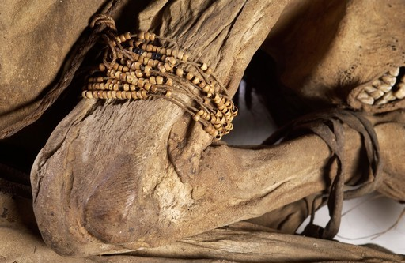

:::::: questions
- This section examines the discourse around ethics in cultural heritage digital data emphasising repatriation, human remains, environmental sustainability and participatory approaches.

:::::: 

## Repatriation 

Over the past few decades, there has been a growing discourse surrounding the repatriation and restitution of objects as part of efforts to decolonise and democratise research and practice in the heritage domain. 

Several policy documents exist at both national and international levels to guide organisations regarding repatriation requests, dialogue, and the practical steps involved in examining and deciding upon such requests. While these documents primarily focus on the restitution of physical artefacts, they also address the digital data and media accompanying physical assets in collections. 

For instance, the [Restitution and Repatriation: A Practical Guide for Museums](https://www.artscouncil.org.uk/supporting-arts-museums-and-libraries/supporting-collections-and-cultural-property/restitution-and-repatriation-practical-guide-museums-england) in England by the Arts Council (2023) emphasises the importance of collection information being accessible and transparent by ensuring that: 

 

- Data include comprehensive information about the **provenance** of collection items, even if they reveal a controversial past. 
- Data provide information about the **historical context**, including how and why items were removed from individuals or communities of origin, and what this reveals about the attitudes of those involved. 
- Records are **updated** with newly discovered information and are **accessible** to anyone interested in learning more about a museum object or its history. 
- Visualisations such as photos and 3D scans are published in an **easily searchable** format on the organisation’s website, ensuring that the format is **accessible** across multiple devices, applications, and platforms. 

Yet, visualisations might have to be kept confidential if there are requests from claimants or for compliance with legal obligations regarding data protection and databases. Access rights might also have to change based on decision outcomes about the objects of interest. The discussion around [digital repatriation](https://www.theartnewspaper.com/2023/03/08/digital-shadows-what-happens-to-an-artefacts-data-after-it-is-restituted) and whether digital data should be kept or returned to claimants is also another interesting aspect of this discussion.

The growing interest in the replication of heritage assets through digital fabrication technologies, including 3D printing, is also relevant to repatriation. Several examples of the deployment of this technology in repatriation efforts are described [here](https://theconversation.com/3d-printing-is-helping-museums-in-repatriation-and-decolonisation-efforts-126449).  

When thinking about physical replication for repatriation purposes, several key considerations include: 

- Advanced technological methods can promote discussions on decolonisation and repatriation and should not be regarded as solutions per se. 
- Collaboration among cultural heritage institutions, initiative groups, and communities is crucial to enable replication and repatriation. 
- Decisions on technology, data sovereignty, access, and replica/object ownership require mutual agreement. 
- Diverse perspectives and priorities of communities must be recognised (i.e., reason for repatriation, meaning of object). 
- A case-by-case examination is essential, as some communities prioritise making processes or spiritual meaning over originality. 

## Human remains 

The term **human remains** is used to mean the bodies, and parts of bodies, of once living people from the species Homo sapiens (defined as individuals who fall within the range of anatomical forms known today and in the recent past). This includes osteological material (whole or part skeletons, individual bones or fragments of bone and teeth), soft tissue including organs and skin, embryos and slide preparations of human tissue. (DCMS, 2005) 

{alt="remains"}
 
 Please note that the term human remains seems the most popular in literature and policy documents, yet voices are expressing a scepticism or opposition to the term. Some parties have proposed other terms, such as ancestral body or physical evidence of an ancestor (HAD, 2021) 

 

Human remains have long been kept in heritage collections, valued for their contribution to research, education, and the dissemination of knowledge. Studying human remains provides valuable insights into various aspects of history, culture, and biology. From exploring the mysteries of human evolution to understanding past population dynamics and health conditions, such research establishes a direct connection to our ancestors and their lifestyles. This not only enhances our comprehension of the past but also informs contemporary discussions on topics such as health, medicine, and cultural diversity. 

The collection, research, study and display of human remains in the UK is guided by governmental and sectorial policy documents, such as the [Human Tissue Act](https://www.legislation.gov.uk/ukpga/2004/30/contents) (2004), [Guidance for the Care of Human Remains in Museums](https://assets.publishing.service.gov.uk/media/5f291770e90e0732e4bd8b76/GuidanceHumanRemains11Oct.pdf) (2005) by the DCMS, the [Guidance for Best Practice for the Treatment of Human Remains Excavated from Christian Burial Grounds in England](https://apabe.archaeologyuk.org/pdf/APABE_ToHREfCBG_FINAL_WEB.pdf) (2017), the [Updated Guidelines to the Standards for Recording Human Remains](https://babao.org.uk/resources/ethics-standards/) (2017) by the Chartered Institute for Archaeologists, the [ICOM Code of Ethics for Natural History Museums](https://icom.museum/wp-content/uploads/2018/07/nathcode_ethics_en.pdf) (2013), and the [ICOM Code of Ethics for Museums](https://icom.museum/wp-content/uploads/2018/07/ICOM-code-En-web.pdf) (2004). Such documents also provide guidance about the return of human remains when such requests exist. 

Most guidance on managing human remains via ethical practices emphasises the need to: 

 
- Securely acquire and house **collections** with human remains and sacred items, respecting professional standards and relevant community beliefs. 

- Conduct **research** on these collections with professional standards and consideration for community beliefs. 

- **Display** collections with sensitivity to community beliefs and dignity, adhering to professional standards. 

- Handle requests for **removal or return** of such items promptly and respectfully, with clear museum policies in place. 

With the advancement of powerful and accessible digitisation methods, along with the capacity to visualise data, including representations of human remains, a new dimension is introduced to this discussion. However, there is currently no specific guidance available to address issues related to digitising human remains and managing such digital data. Therefore, the examination and dissemination of digital data about human remains must adhere to the ethical guidance outlined above.  

Within this frame, some museums have chosen not to exhibit human remains or images of remains to the public. For instance, the Pitt Rivers Museum in Oxford not only [removed all human remains from the museum displays](https://www.prm.ox.ac.uk/human-remains-pitt-rivers-museum-university-oxford) in 2020, but also disabled access to visualisations of digitised human remains through its online database. These are now available per request and full lists (only with text) of human remains in the museum’s collection are published in pdf format. In this way, the museum aims to facilitate dialogue with communities to decide about the future care or return of remains.  

## Environmental responsibility

Under the current concerns about climate change and the escalating volume of data, alongside the emergence of AI applications for data management, there is a growing dialogue on environmental responsibility. In the context of digital data, being environmentally responsible involves managing digital information in a way that minimises its negative impact on the environment while ensuring long-term preservation and access. 

{alt="flower"}

The main environmental impacts arising from digital activity in the cultural heritage domain and beyond include: 

- **Energy consumption**: Infrastructure, including data centres, servers, networks, and end-user devices, requires significant amounts of energy to operate. This energy consumption comes from the continuous need for electricity to power and cool these systems. 

 

- **Carbon emissions**: The majority of the world's electricity still comes from fossil fuel sources such as coal, oil, and natural gas. When infrastructure relies on electricity generated from these sources, it results in carbon emissions, which contribute to global warming and climate change. 

 

- **Manufacturing and disposal**: The production, distribution, and disposal of equipment also contribute to climate change. The manufacturing process requires energy and raw materials, and the disposal of electronic waste (e-waste) can lead to environmental pollution if not managed properly. 

 

- **Internet usage**: The increasing demand for internet services, streaming media, cloud computing, and data storage contributes to the overall energy consumption of communication technology infrastructure. Data centres, in particular, consume vast amounts of energy to process and store data. 

 

- **Digitisation**: While it has the potential to enable more efficient and sustainable practices in various heritage management processes, the overall increase in digitisation can lead to a net increase in energy consumption and carbon emissions if not managed carefully. 

Currently, there is a lack of established guidance to direct decisions and actions toward sustainability goals for digital data management. However, ongoing efforts exist to evaluate the environmental impact of digital activity in the heritage domain and suggest appropriate measures to enhance environmental sustainability.

Some of these efforts include: 

 
- The [Digital Humanities Climate Coalition Toolkit](https://sas-dhrh.github.io/dhcc-toolkit/) which aims to help researchers and practitioners to adapt working practices to become more environmentally responsible. The toolkit includes general guidance about hardware, software, data storage, content management systems, use of video and images, the use of AI, as well as grant writing, travelling to work and more. 

 

- The [Researcher Guide to Writing a Climate Justice-Oriented Data Management Plan](https://zenodo.org/records/6451499) which has been published by the same initiative to support with data management planning from a climate justice perspective. 

 

Further guidance by the Digital Heritage Hub provides advice on how to make [digital engagement activities more friendly for the environment](https://www.culturehive.co.uk/digital-heritage-hub/resource/engagement/make-your-digital-engagement-activities-better-for-the-environment/#what-next).  

## Participatory approaches 

Participatory approaches to planning, acquiring, curating and publishing data have been gaining interest and have been adopted by individuals and organisations to overcome ethical considerations and become more inclusive. Participatory research involves collaborative efforts where individuals affected by the research are actively engaged in planning, acquiring, curating and publishing data. Participatory research aims to promote social justice by ensuring that all voices are heard and respected throughout the research process. 

{alt="participatory"}

While participatory efforts can greatly benefit processes around data throughout their lifecycle, it is important to overcome potential difficulties when working with communities and digital data. Such obstacles might be related to power dynamics, cultural reasons, hidden biases, conflicting individual and community interests, confidentiality in difficult contexts and more. 

 

To leverage participatory approaches when working with data in collaboration with communities, researchers and practitioners should:   
- Ensuring participants or their representatives have the autonomy to make **informed decisions** about their involvement in research and treating them with **dignity** throughout the research process. 

- Safeguarding the **well-being** of research participants or communities, minimising potential harm during the research process. 

- Upholding principles of **fairness** by equitably distributing the costs and benefits of research, allowing participants access to its outcomes. 

- Acknowledging the responsibility of researchers to maintain confidentiality, act on matters concerning participant **welfare** or **public safety**, and disclose relevant information transparently. 

- Committing to **transparent communication** by openly discussing the research purpose and presenting findings truthfully in analysis, presentation, and publication. 

- Ensuring research contributes **positively to society** by advancing human knowledge and promoting well-being. 

::::::::::: challenge

## Challenge: Case study reflection

Look at the cases below and think about whether they involve digital data ethical considerations. Then try to write down some responses to the questions below. 

Nefertiti hack: [resource 1](https://arstechnica.com/tech-policy/2016/03/one-of-the-greatest-art-heists-of-our-time-was-actually-a-data-hack/) and [resource 2](https://reason.com/2019/11/13/a-german-museum-tried-to-hide-this-stunning-3d-scan-of-an-iconic-egyptian-artifact-today-you-can-see-it-for-the-first-time/) 

 

Tlingit Killer Whale Hat: [resource 1](https://www.smithsonianmag.com/smithsonian-institution/replica-tlingit-killer-whale-hat-spurring-dialogue-about-digitization-180964483/) 

 
Nomad Project: [resource 1](https://nomad-project.co.uk/)

 

 

- Are there any data ethical considerations which arise from this case? 

- Were there any considerations concerning FAIR and CARE principles? 

- How have the different parties responded to the use and sharing of digital data? 

- What are the implications of this case for the future of discussions about ethics in the digital heritage data domain? 

 
:::::::::::
