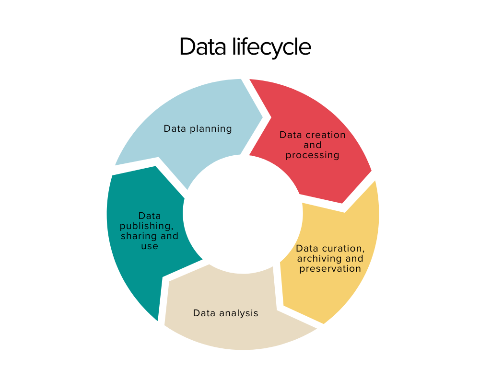
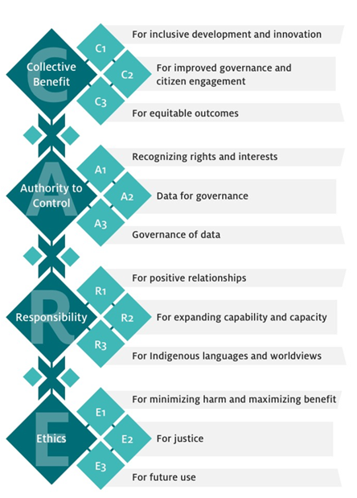

:::::: questions

- Here we present the FAIR and CARE principles which can guide data creators, stakeholders, and publishers in effectively managing ethical data.

:::::: 

The previous sections discussed the definition of ethics and presented the main considerations that researchers and practitioners should have in mind when dealing with digital data in the heritage domain. All the considerations mentioned about ethics should be taken into account throughout the digital data lifecycle. 

{alt="cycle"}

For instance, when **planning data collection**, considerations such as **ownership of data** and **cultural sensitivities** must be addressed. Who are the owners or creators of the objects and practices we want to digitise and collect data about? Should we consider cultural sensitivities and potential issues that may arise from collecting such data? Are there biases involved in selecting these objects and associated data? Are our data sufficiently representative? 

 

During **data collection**, it's essential to adhere to best practices and **standards** governing our processes and workflows. Moreover, obtaining full **consent** for data collection, maintaining **transparency** about our practices, **securing** data, and ensuring the **reliability** of the digitisation and data collection process are crucial. 

 

Therefore, Privacy and Consent, Cultural Sensitivity, Ownership and Intellectual Property, Data Security, Transparency and Standardization, Reliability, Equity and Accessibility, Data Preservation, and Avoiding Bias and Discrimination can constitute a valuable set of considerations to adopt throughout the digital data lifecycle. 

 

In the realm of digital humanities and beyond, **FAIR** and **CARE** principles can guide data creators, stakeholders, and publishers in effectively managing ethical data within the Open Data movement. If you're interested in learning more about the Open Data movement, you can explore this [resource](https://data.europa.eu/elearning/en/module1/#/id/co-01) provided by the European Commission. 

## FAIR Principles

The FAIR principles refer to a set of guidelines aimed at enhancing the accessibility and reusability of digital data. FAIR stands for **Findable, Accessible, Interoperable, and Reusable**. These principles emphasise the importance of making data easy to find, access, integrate with other datasets, and reuse for different purposes. They promote the use of standardised metadata, persistent identifiers, open communication protocols, and clear data usage licenses to ensure that data can be discovered, accessed, and utilised effectively by both humans and machines.  

](fig/pcbi.1007854.g001.PNG_L.png){alt="simple rules"}

The following actions can help researchers and practitioners to FAIRify data.

### Data should be Findable 

- Data should be linked to rich and structured metadata. 
- Where possible this should be made accessible through a searchable resource such as an aggregation platform. 
- Data should be accessible through persistent identifiers (which do not change over time). For example, [DOIs](https://www.doi.org/the-identifier/what-is-a-doi/)can be assigned to data through platforms such as [Zenodo](https://zenodo.org/) or [Github](https://github.com/). 

### Data should be Accessible 

- Metadata should be accessible via using a protocol for web, such as HTTP/HTTPS which allows to access a webpage over the browser or query a database through a service known as Application Programming Interface (API). 
- Where necessary, the protocol show allow for authentication and authorisation to enforce data management rights. 
- Consider who will be excluded from access the data, for instance if this is only available via an institutional platform or in a particular language. 

### Data should be Interoperable 

- Consider how other users will bring together content from various data sets, for instance to create a new project. 
- For visual media, including images, video and 3D, [IIIF](https://iiif.io/get-started/how-iiif-works/) (pronounced “triple-eye-eff”) supports interoperability across websites and institutions. 
- This framework allows to provide access and shared links to a file, as well as its (meta)data. 
- When implemented across many institutions it overcomes data silos. 

For example, through IIIF it is possible to bring together objects which physically might be in different locations. It does not require a user to download the files but simply to access the files and metadata over the web. 

### Data should be Reusable 

- Multidimensional data should be released with a clear and accessible data usage license. 
- Provenance data will help data not becoming lost. 

::::::::::::: keypoints

|  Principle          | Key Points                        |
|---------------------|-----------------------------------|
| **Findability**         | - Available metadata   - Allow for searchability   - Persistent IDs |
| **Accesibility**        | - Use web protocols for access   - Allow for authorisation   - Digital inclusion/exclusion |
| **Interoperability**    | - Data integration   - Overcomes data silos   - IIIF for visual media |
| **Reuse**              |  - License content   - Avoid data becoming lost |

::::::::::::: 

## CARE Principles 

 

The CARE principles for Indigenous Data Governance enhance the FAIR principles by adding a social responsibility dimension to open data management practices. Therefore, the data-centric focus of the FAIR principles is complemented by principles emphasising the **people** (creators, users of data) and the **purpose** of the data too. 

 

The CARE Principles for Indigenous Data Governance outline key considerations for the ethical and responsible use of Indigenous data. These are presented below (Research Data Alliance International Indigenous Data Sovereignty Interest Group, 2019). 

### Collective benefit 

 

``
Data ecosystems should enable Indigenous communities to derive benefit from the data. 
``

- **For inclusive development and innovation**: Governments and institutions should support Indigenous nations and communities in utilising data for innovation and local development processes. 
- **For improved governance and citizen engagement**: Data should improve planning, engagement, and decision-making. Ethical open data usage boosts transparency and understanding of Indigenous populations, territories, and resources and influences policies affecting Indigenous communities. 
- **For equitable outcomes**: Indigenous data should benefit Indigenous communities equitably, contributing to their aspirations for well-being. 

### Authority to control 

 
``
Indigenous people’s rights and authority over Indigenous data must be acknowledged, empowering them to control how their communities and territories are represented. 
``
 

- **Recognising rights and interests**: Indigenous communities have collective and individual rights to free, prior, and informed consent in the collection and use of Indigenous data, including the development of data policies and protocols for collection. 
- **Data for governance**: Indigenous communities should have access to data that align with their perspectives and contribute to self-determination and self-governance. Indigenous data should be accessible to people and nations to facilitate Indigenous governance. 
- **Governance of data**: Indigenous communities possess the right to establish cultural governance protocols for Indigenous data and take leadership roles in managing and accessing such data, particularly concerning indigenous knowledge. 

### Responsibility 

 
``
Those working with Indigenous data have a responsibility to support Indigenous self-determination and collective benefit, with transparent evidence of these efforts. 
``
 

- **For positive relationships**: Relationships built on respect, reciprocity, trust, and mutual understanding should underpin the use of Indigenous data. Such data should respect the dignity of Indigenous people and communities. 
- **For expanding capability and capacity**: Efforts should be made to enhance data literacy within Indigenous communities and support the development of Indigenous data infrastructure and workforce to support data management effectively. 
- **For Indigenous languages and worldviews**: Resources should be provided to generate data grounded in Indigenous languages, worldviews, and lived experiences. 

 

### Ethics 

 
``
Indigenous Peoples' rights and well-being should be the main concern at all stages of the data life cycle.
``
 

- **For minimising harm and maximising benefit**: Ethical data avoid stigmatising Indigenous people or their cultures and are collected in line with Indigenous ethical standards and [UNDRIP rights](https://www.un.org/development/desa/indigenouspeoples/wp-content/uploads/sites/19/2018/11/UNDRIP_E_web.pdf). Assessing ethical benefits and harms should adopt the perspectives of Indigenous communities. 
- **For justice**: Ethical practices address unfair power and resource distributions that affect Indigenous and human rights, and they should include input from relevant Indigenous communities. 
- **For future use**: Data governance should consider future uses and potential harms based on ethical frameworks aligned with Indigenous values. Metadata should indicate origin, purpose, and any restrictions, including consent issues, for secondary use. 

### Local Contexts
 
[Local Contexts](https://localcontexts.org/licenses/traditional-knowledge-licenses/) was inspired by Creative Commons, with the objective to create a fresh and supplementary suite of licenses tailored to accommodate the varied intellectual property requirements of Indigenous peoples.

The Local Contexts include two sets of labels to license Indigenous communities knowledge:
 
The **Traditional Knowledge (TK) Labels** represent an effort tailored to Indigenous communities. Through extensive collaboration and validation within Indigenous communities spanning various nations, these Labels empower communities to articulate their unique terms for participation in future research and partnerships, aligning with established community norms, governance structures, and protocols governing the use, sharing, and dissemination of knowledge and data. These Labels facilitate the incorporation of local access and usage protocols for cultural heritage that is digitally disseminated beyond the confines of the community.
 
The **Biocultural (BC) Labels** establish the standards for how biocultural collections and data should be ethically utilised according to community expectations. They emphasise the importance of precise origin information, openness, and ethical conduct in research collaborations with Indigenous communities.
 
An effort to accommodate assets within the above context is the [Mukurtu Content Management System](https://mukurtu.org/).

